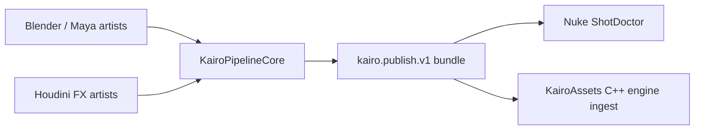

# Kairo Production Tools

An open-source, multi-DCC asset pipeline portfolio built around one production
contract: diagnose artist work early, publish immutable content with provenance,
and verify it again at every downstream boundary.

## Repositories

| Project | Artist problem | Main evidence |
|---|---|---|
| [KairoPipelineCore](https://github.com/swayam8624/KairoPipelineCore) | DCC tools need one safe publish contract | Python, strict manifests, rollback-safe atomic publication |
| [KairoBlender](https://github.com/swayam8624/KairoBlender) | Assets reach the engine with preventable errors | Native Blender panel, diagnostics, safe fixes, glTF publish |
| [KairoHoudini](https://github.com/swayam8624/KairoHoudini) | Long caches fail late or are recooked wastefully | Missing-range resume, stale-upstream and disk-budget checks |
| [KairoNuke](https://github.com/swayam8624/KairoNuke) | Bad plates and outputs reach render submission | Read/Write preflight and cross-DCC hash validation |
| [KairoMaya](https://github.com/swayam8624/KairoMaya) | Scene/reference problems survive until handoff | API 2.0 inspection, dockable diagnostics, scene package publish |
| [KairoAssets](https://github.com/swayam8624/KairoAssets) | The engine must not trust mutated DCC output | C++23 strict manifest ingest, SHA-256 verification, glTF registration |

The [UTS Technical Direction portfolio](output/pdf/Swayam_Singal_UTS_Technical_Direction_Portfolio.pdf)
is generated from versioned project evidence and capped below the required ten
pages. Native host status is reported honestly in the
[verification matrix](docs/NATIVE_VERIFICATION.md).

## Design principles

- artist-facing diagnostics carry stable codes, severity, suggestions, and
  navigable host locations;
- safe fixes are bounded and explicit; destructive artistic decisions remain
  with the artist;
- dry-run creates no destination state;
- publication fingerprints inputs, stages a complete version, verifies it,
  then atomically exposes it;
- host-neutral rules run in CI while native DCC behavior remains a separate
  release gate.
